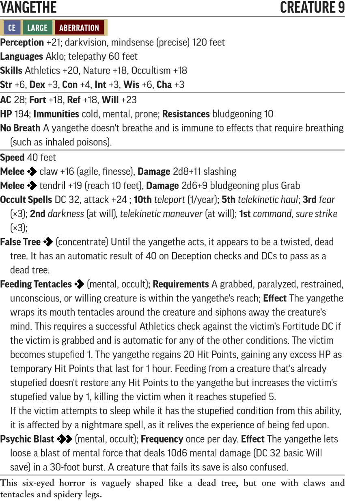
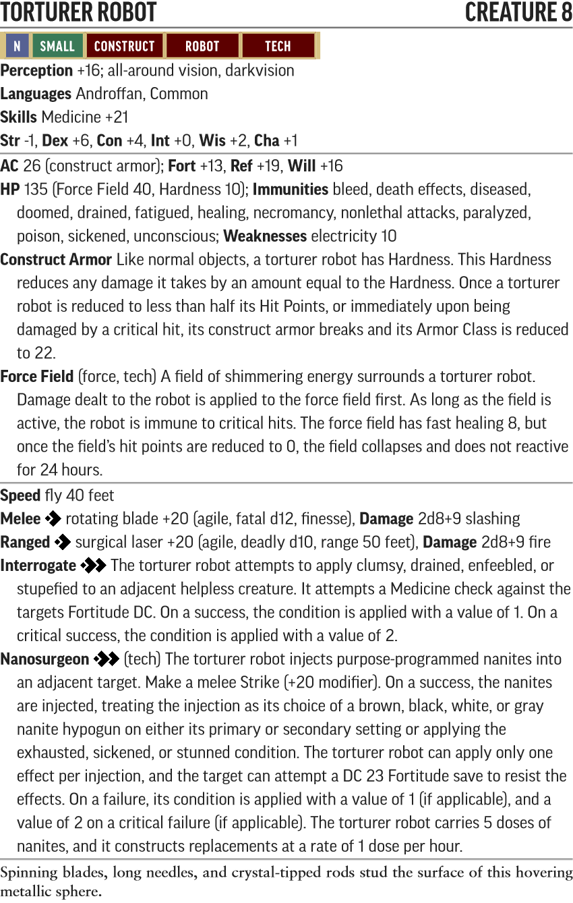

# Valley of the Brain Collectors - Creature Statblocks

Any listed items with a carat (^) at the end is a item that does not exist in the current Pathfinder 2e SRD. These items will be linked below their statblock.

For creatures with new traits like Technology, Robot and Extraterrestrial, please see their entry in the [New Traits](/Traits/README.md) document.

Use the PF2 Tools JSON files with [https://monster.pf2.tools/]. Be aware these do **NOT** import directly into FoundryVTT.

## Named NPCs

### Mad Paeytr

* [PF2 Tools JSON](PF2Tools/MadPaeytr.json)
* [PDF](PDFs/MadPaeytr.pdf)

### Harab

### Hyrsek Caio

### Nemgedder Janz

### Isuma

### Shub-Niggurath

### Lrrhech

### Engine Attendant

### Deteriorating Shipmind

### Maukui

### Paajgat

### Casandalee

## New Creatures

### Red Mold Ogre Spider

* [PF2 Tools JSON](PF2Tools/RedMoldOgreSpider.json)
* [PDF](PDFs/RedMoldOgreSpider.pdf)

Red Mold Ogre Spider is built as an Ogre Spider increased to 8th Level with reduced Dexterity and the Mindless trait, granted Fast Healing and Resistance to physical damage, and the Aberration type instead of Animal.

### Yangethe

* [PF2 Tools JSON](PF2Tools/Yangethe.json)
* [PDF](PDFs/Yangethe.pdf)

### Penitent Android

### Torturer Robot

* [PF2 Tools JSON](PF2Tools/TorturerRobot.json)
* [PDF](PDFs/TorturerRobot.pdf)

### Guardian of Binox

### Reclamation Robot

### Elite Voonith

### Chaos Beast of Shub-Niggurath

### Colour-Blighted Froghemoth

### Colour Out of Space

### Elite Lukwata

### Damaged Annihilator Robot

### Ugothokra

### Inhabited Kasatha

### Adult Void Dragon

### Yah-Thelgaad
