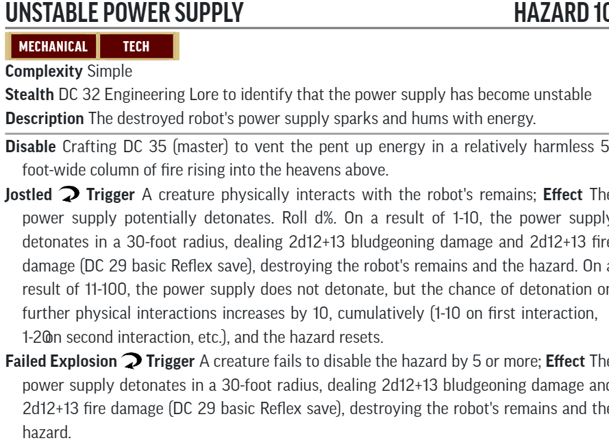
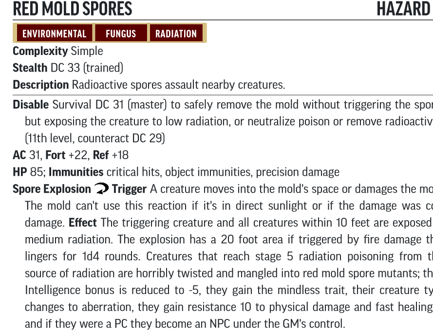

# Hazard Statblocks

Use the PF2 Tools JSON files with [https://template.pf2.tools/]. Be aware these do **NOT** import directly into FoundryVTT.

## Part 1. Scar of the Spider

### Unstable Power Supply

* [PF2 Tools JSON](PF2Tools/UnstablePowerSupply.json)
* [PDF](PDFs/UnstablePowerSupply.pdf)

## B. Infested Cavern

### Red Mold Spores

* [PF2 Tools JSON](PF2Tools/RedMoldSpores.json)
* [PDF](PDFs/RedMoldSpores.pdf)

### Grenade Trap

### Steam Blast

### Toxic Sludge

### Dominion Plague

### Rotting Floor Explosion

### Shrieking Incubator

### Dominion Disposal Chamber

### Dominion Brain Pillar

### Plasma Pit

### 
